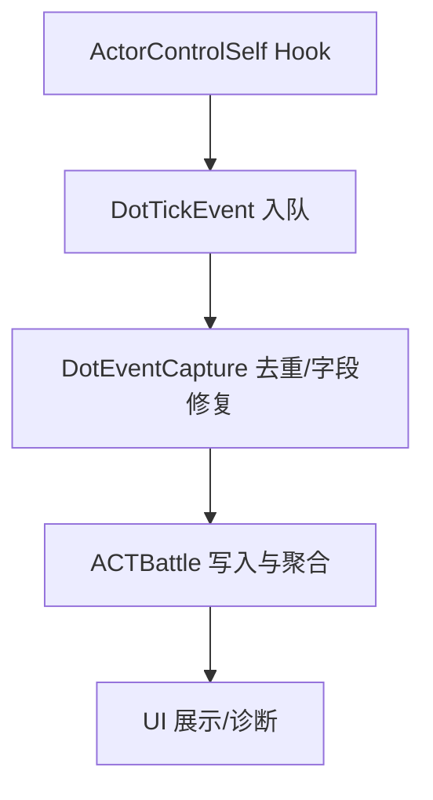

# 技术设计: DoT tick 归因与明细增强

## 技术方案

### 核心技术
- C# / .NET / Dalamud
- Hook：复用现有 `ActorControlSelf` Hook 获取 DoT tick
- 事件聚合：`DotEventCapture` 统一排队、去重与字段修复，并写入 `ACTBattle`

### 实现要点
1. **统一 DoT tick 事件模型**
   - 定义 `DotTickEvent { TimeMs, SourceId, TargetId, BuffId, Damage, Channel }`
   - DoT 入口统一转换为该模型，并由 `DotEventCapture.FlushInto(ACTBattle)` 单点写入

2. **增强归因（buffId=0 唯一匹配）**
   - 条件：`EnableEnhancedDotCapture=true` 且 `SourceId` 已知 且 `BuffId==0`
   - 策略：扫描目标 `StatusList`，筛选 `DotPot` 中的 DoT 状态，按 `(targetId, sourceId)` 唯一匹配一个 `StatusId`
   - 约束：若同源存在多个 DoT（如双 DoT 职业），不做推断（避免误归因）

3. **去重机制**
   - `DotEventCapture` 维护小窗口（~800ms）去重缓存，Key 由 `(sourceId,targetId,damage)` 混合生成
   - 目的：避免未来多入口并存时重复计入造成伤害翻倍

4. **统计写入规则**
   - `SourceId` 可用：
     - 累计到 `DotDamageByActor`（Tooltip 的 Tick 部分）
     - 写入总伤害：`buffId` 映射 actionId → `AddEvent(actionId)`；否则
       - `EnableEnhancedDotCapture=true` 且 `buffId!=0` → `AddEvent(buffId)`（按状态明细展示）
       - 其余 → `AddDotDamage`（只计入总伤害）
   - `SourceId` 不可用：
     - 走 `ACTBattle.AddEvent(from=E0000000)`，累计到 `TotalDotDamage` 并触发目标状态扫描/模拟补正（维持旧口径）

5. **诊断与可观测性**
   - `EnableDotDiagnostics=true` 时：
     - UI 设置窗口展示入队/处理/去重/未知来源/buffId=0/推断次数
     - 输出 Verbose 级别 DoT tick 处理日志（含字段修复后的 src/tgt/buff/dmg）

> 说明：原方案中计划使用 `IGameNetwork` 作为增强采集入口，但 SDK 已将其标记为 `Obsolete(error)`；本次实现保留 legacy Hook，并通过统一管线与增强归因解决主要问题。

## 架构设计

## 测试与验证
- 构建验证：`dotnet build DalamudACT.sln -c Release`
- 游戏内验证（建议）：
  1) 本地学者持续挂 Biolysis，开启 `EnableEnhancedDotCapture`，观察技能明细中的 DoT 状态伤害随 tick 递增
  2) 队友白魔持续挂 Dia，观察队友 DoT 同样随 tick 递增
  3) 开启 `EnableDotDiagnostics`，确认推断次数合理、去重命中为 0 或极低（不出现伤害翻倍）
