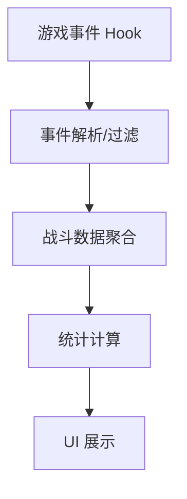
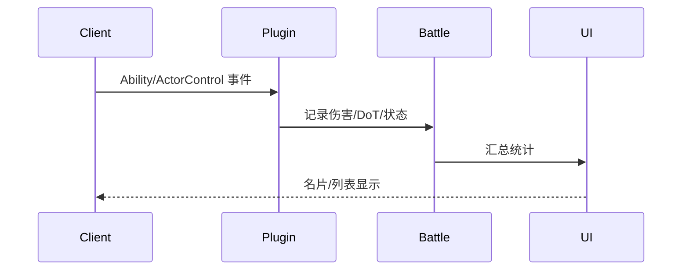

# 架构设计

## 总体架构

## 技术栈
- **后端:** C# / .NET / Dalamud
- **前端:** ImGui（Dalamud UI）
- **数据:** 游戏内事件与 Lumina 数据表

## 核心流程

## 重大架构决策
完整的ADR存储在各变更的how.md中，本章节提供索引。

| adr_id | title | date | status | affected_modules | details |
|--------|-------|------|--------|------------------|---------|
